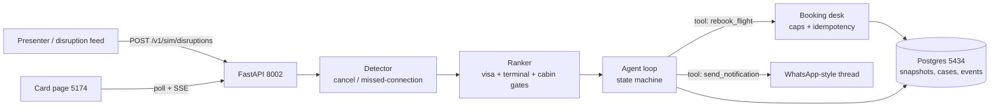
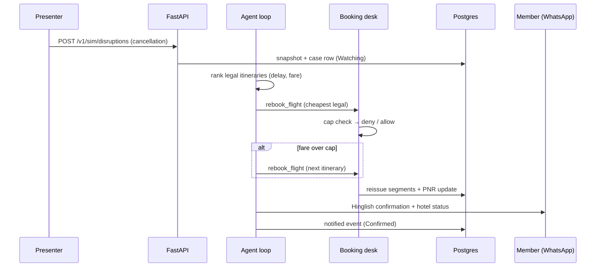

# Autonomous Travel-Disruption Concierge

An agentic AI concierge for premium travel cards. When a flight is cancelled
or a connection is missed, it **detects the disruption, evaluates
alternatives, rebooks, extends the hotel, and notifies the member — with zero
manual action**. There is no rebook button anywhere in the product, and no
chat box: when a model is plugged in, it calls three tools (`search`,
`rebook`, `notify`). Booking is always performed by code.

## 1. Purpose — what problem does this solve?

Flight cancellations and missed connections are stressful, and today they
degrade into manual rebooking: calling the airline, waiting on hold, and
comparing options against the clock. For a travel card, that moment *is* the
benefit — and most concierge products stop at showing itineraries instead of
acting on them.

This project closes that gap end to end:

- **Detects** cancellations and missed connections the moment they occur,
  using terminal-aware minimum connection times (a 50-minute Heathrow
  T2→T5 transfer is a miss; a flat "40 minutes" rule would call it legal).
- **Decides** with explicit, auditable gates: visa/entry rules, cabin rules,
  delay limits, and a per-trip benefit cap. Every rejection carries the exact
  reason — never a generic "not available".
- **Acts**: rebooks on its own desk (up to 3 fares), extends the hotel when
  arrival moves to the next day, and notifies the member in Hinglish.
- **Shows its work**: the card page streams the agent's trace live, so anyone
  watching sees the rule break, the money stop, and the agent pivot.

## 2. System overview



A single cancellation flows through the system like this:



## 3. Demo — three members, one switcher

```bash
cd deploy
docker compose up --build
```

Card page: **http://localhost:5174** · API: http://localhost:8002

| # | Trip | Fire | What you see |
|---|---|---|---|
| 1 | Ananya · DEL T3 → LHR → JFK | `1. Cancel AI111` | Toronto rejected (needs Canadian entry), AI111/BA173 rejected (T2→T5 needs 90, has 80), **BA143/BA115 ₹22,000** booked. Board flips to Reissued. |
| 2 | Rohan · BOM T2 → FRA T1 → ORD T5 | `1. Cancel LH756` | Frankfurt 30-min option rejected (needs 45), Dubai rejected (transit visa), **LH756/LH402 ₹18,000** booked. |
| 3 | Priya · DEL T3 → LHR → SFO | `1. Cancel AI111` | Dubai + tight-Heathrow rejected, nothing same-day is legal → **next-day Paris booked, hotel +1 night extended**, WhatsApp says so. |
| 4 | Any trip | `2. Benefit cap ₹10,000` | Same trace, nothing booked, WhatsApp stays quiet. |
| 5 | Any trip | Inbound-delay slider | Below the airport's threshold: "still legal 65/45". Above it: the agent fires. Different airport, different rule — visible in numbers. |

Further reading: [`docs/ARCHITECTURE.md`](docs/ARCHITECTURE.md) (components,
API table, failure modes, scaling, load numbers).

## 4. How decisions are made

- **Missed connection** is terminal-aware. One shared `mct_minutes()` table
  (Heathrow T2→T5 90, same terminal 60, Frankfurt 45, Toronto 75) is used by
  both the detector and the ranker; flat 40 minutes is only a floor.
- **Visa gates** are explicit: Toronto forces Canadian entry (a US B1/B2 is
  not a Canadian visa), Dubai forces a UAE transit visa. The rejection says
  so, instead of blaming the price.
- **Ranking** is delay, then extra fare, then airline continuity — economy
  cabin only, 6-hour delay window. Next-day arrival is allowed and extends
  the hotel rather than blocking.
- **Benefit split** is half Membership Rewards / half card
  (`POST /v1/fare-quote` is the single source of truth, shared by the API
  and the unit tests). The Plaza Premium lounge voids on cancel and reissues
  on the new flight.

## 5. Project structure

```
travel-concierge/
├── agent/            # detector, ranker, loop, desk, benefit, trip registry, store, server
│   ├── trip.py       # TRIPS registry: passengers, hotels, seeds, per-trip inventories
│   └── schema.sql    # snapshots, cases, events, notifications
├── web/              # card page (React + Vite): switcher, board, fares, trace, WhatsApp
├── tests/            # ranker / detector / benefit / loop / boundary — no Docker needed
├── deploy/           # docker-compose.yml + Dockerfile + .env.example
├── docs/             # ARCHITECTURE.md — full system design
├── bench.py          # read-path load harness (stdlib only)
└── requirements.txt  # fastapi, uvicorn, psycopg, pydantic, pytest
```

## 6. Configuration, tests, load

No `.env` file is needed: compose ships safe demo fallbacks and the API reads
`DATABASE_URL` (or `POSTGRES_*`) from the environment. Copy
`deploy/.env.example` to `deploy/.env` only to override. No secrets are
committed — `.env` is gitignored.

```bash
python -m pytest            # 18 unit tests, Docker not required
python bench.py 50 50       # read-path: board p95 ~65ms at 50-burst, ~23ms at 20 req
```

Live-verified numbers: SSE first trace line <1s after disruption, `.ics`
download 200 with reissued segments, fare-quote 22000 → 11000 + 11000.

## 7. Tech stack

Python (FastAPI) · PostgreSQL 16 · React + Vite · Server-Sent Events ·
Docker Compose.
